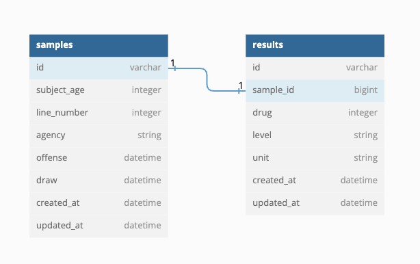

# Chematox-db
## Table of contents
- [Project Description](#project-description)
- [Schema](#schema)
- [Setup](#setup)
- [Endpoints](#endpoints)


___

## Project Description
You are a back-end developer working on a team that is building an application to search for cuisines by country, and provide opportunity to learn more about that countries culture. This app will allow users to search for recipes by country, favorite recipes, and learn more about a particular country.

Your team is working in a service-oriented architecture. The front-end will communicate with your back-end through an API. Your job is to expose that API that satisfies the front-end team’s requirements.

___

## Setup

- `Ruby 3.2.1`
- `Rails 7.0.4.2'`
- [Fork this repository](https://github.com/mullinsand/chematox-db)
- Clone your fork
- From the command line, install gems and set up your DB:
- `bundle install`
- `rails db:{create,migrate,seed}`
- run the server with 'rails s'
___

## Schema: 



- Drop in the code below to dbdiagram.io for interactive diagram
```
Table "results" {
  "id" varchar
  "sample_id" bigint
  "drug" integer
  "level" string
  "unit" string
  "created_at" datetime
  "updated_at" datetime
}

Table "samples" {
  "id" varchar
  "subject_age" integer
  "line_number" integer
  "agency" string
  "offense" datetime
  "draw" datetime
  "created_at" datetime
  "updated_at" datetime
}

Ref "fk_rails_results_samples":"results"."sample_id" - "samples"."id"
```
___

## Endpoints
